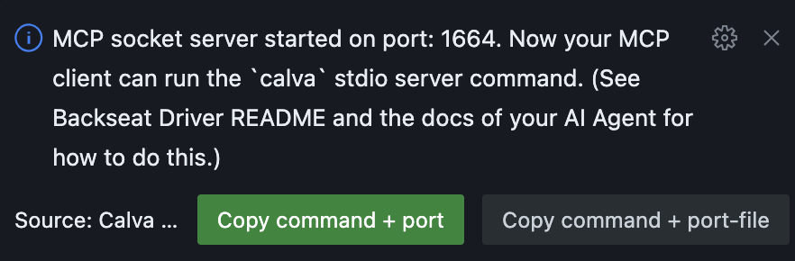

# Configure Backseat Driver as an MCP Server

If you are using Backseat Driver with harnesses _other than_ Copilot or [Cursor](https://www.cursor.com/), you'll need to configure an MCP server.

## How it works

Backseat Driver runs a socket server inside the VS Code Extension Host and writes a port file when it starts. Your MCP client starts a small Node **stdio wrapper** that connects to that socket. The wrapper accepts either a port number or a path to the port file.

There is one Backseat Driver MCP server per workspace. The port file will be created at `<workspace-root>/.calva/mcp-server/port`.

* Default socket port is `1664`. If that port is busy, a random available port is used instead.
* Change the preferred port with `calva-backseat-driver.mcpSocketServerPort`. Use `0` to always pick a random port.

## What you need to do

With your project opened in VS Code (or fork):

1. Start the Calva MCP socket server (**Calva Backseat Driver: Start the MCP socket server**), or configure the MCP server to auto-start. Backseat Driver will:
   * Create the port file
   * Show a confirmation dialog offering a button: **Copy command + port** or **Copy command + port-file** for your MCP client config

     
2. Add the MCP server in your client (steps vary by client)

## Configuration

Backseat Driver is per-project, so configure it at the project/workspace level when your client allows that.

* **Project-level config:** prefer the **port file** as the wrapper argument (`.calva/mcp-server/port` in a single-root window).
* **No project-level config:** assign different socket ports per project via `mcpSocketServerPort`, then point your client's stdio command at that port for the session you are in.

### Cursor

No config needed for Cursor. Backseat Driver handles this for you, Zero Conf, the MCP server will be named `extension-backseat-driver`. If for some reason you need to configure this manually, you can disable the automatic Cursor config and MCP connect by settting `autoRegisterCursorMcp` to `false`. 

### Windsurf configuration

Please help with providing info here.

### Claude desktop

Claude Desktop doesn't run in VS Code and has no project/workspace concept, so use its global MCP config. The app can open that file for you. Using an absolute path to the port file in the stdio command is usually easiest.

```json
{
  "mcpServers": {
    "backseat-driver": {
      "command": "node",
      "args": [
        "<absolute path to calva-mcp-server.js>",
        "<absolute path to your project root's `.calva/mcp-server/port`>"
      ]
    }
  }
}
```

### Antigravity

Please help with providing info here.

### Other MCP client?

Please add configuration for other AI clients! 🙏

Cursor auto-registration works without a workspace folder (single-file or folder-less windows use the extension's global storage for the port file). When auto-registration is enabled, a random port is used (the configured static port is respected only when auto-registration is disabled).
