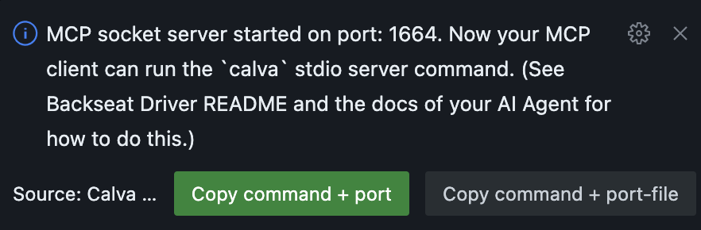

# Configure Backseat Driver as an MCP Server

If you are using Backseat Driver with harnesses _other than_ Copilot or [Cursor](https://www.cursor.com/), you'll need to configure an MCP server.

## How it works

Backseat Driver runs a socket server inside the VS Code Extension Host. Your MCP client starts a small Node **stdio wrapper** that connects to that socket (port number, or the path from **Copy command** / `bb list`).

There is one Backseat Driver MCP server per workspace. Change the preferred port with `calva-backseat-driver.mcpSocketServerPort`. Use `0` (default) to always pick a random available port.

While the socket is running, Backseat Driver also writes a live JSON entry to `~/.config/vscode-mcp/registry/windows/backseat-driver-<window-id>.json` (when `calva-backseat-driver.enableMcpRegistry` is `true`, the default). External agents (bots, phone clients, other machines that can see that home directory) can scan the folder, treat an entry as live when its `pid` is still running and `updatedAt` is less than 60 seconds old, then attach with:

```
node <mcp.wrapperPath> <mcp.portFilePath> <mcp.host>
```

`sessions` on the entry is compact (`replSessionKey`, absolute `projectRoot`, `globs`, and a short runtime summary). Query full Shadow-cljs runtimes via MCP after you attach.

## What you need to do

With your project opened in VS Code (or fork):

1. Start the Calva MCP socket server (**Calva Backseat Driver: Start the MCP socket server**), or configure the MCP server to auto-start. Backseat Driver will:
   * Create the port file
   * Show a confirmation dialog offering a button: **Copy command + port** or **Copy command + port-file** for your MCP client config

     
2. Add the MCP server in your client (steps vary by client)

## Configuration

Backseat Driver is per-project, so configure it at the project/workspace level when your client allows that.

* **Project-level config:** use **Copy command + port-file** from the start dialog, or `bb list` under `~/.config/vscode-mcp/registry`. (Or hand Claude that registry folder and ask it to set the MCP server up.)
* **No project-level config:** assign different socket ports per project via `mcpSocketServerPort`, then point your client's stdio command at that port for the session you are in.

### Cursor

No config needed for Cursor. Backseat Driver handles this for you, Zero Conf, the MCP server will be named `extension-backseat-driver`. If for some reason you need to configure this manually, you can disable the automatic Cursor config and MCP connect by settting `autoRegisterCursorMcp` to `false`. 

### ECA

No config needed when the ECA extension is installed and a workspace is open. Backseat Driver upserts project-local `.eca/config.json` (server key `backseat-driver`). Opt out with `calva-backseat-driver.autoRegisterEcaMcp` set to `false`. Stop does not remove the ECA entry. No Register-with-ECA command.

### Windsurf configuration

Please help with providing info here.

### Claude desktop

Claude Desktop doesn't run in VS Code and has no project/workspace concept, so use its global MCP config. The app can open that file for you. Prefer **Copy command + port-file** or `bb list` for the args.

```json
{
  "mcpServers": {
    "backseat-driver": {
      "command": "node",
      "args": [
        "<absolute path to calva-mcp-server.js>",
        "<port file path from Copy command or bb list>"
      ]
    }
  }
}
```

### Antigravity

Please help with providing info here.

### Other MCP client?

Please add configuration for other AI clients! 🙏

Cursor auto-registration works without a workspace folder. When auto-registration is enabled, a random port is used (the configured static port is respected only when auto-registration is disabled).
