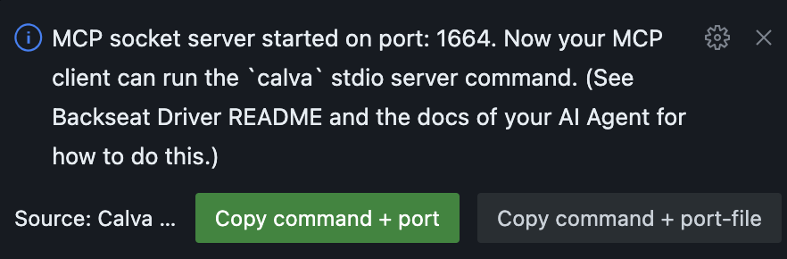
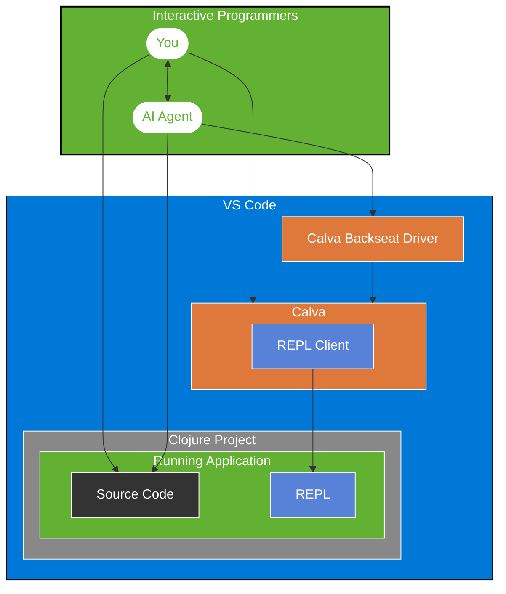

# Make CoPilot an Interactive Programmer

Clojure Tools for CoPilot

> It is also an MCP Server for Calva

(Parts of this README is written by Claude Sonnet. Pardon any marketing language. I will clean up.)

[](https://marketplace.visualstudio.com/items?itemName=betterthantomorrow.calva-backseat-driver)
[](https://github.com/BetterThanTomorrow/calva-backseat-driver/issues)
[](https://github.com/BetterThanTomorrow/calva-backseat-driver/blob/master/LICENSE.txt)

A VS Code language model extension for [Calva](https://calva.io), the Clojure/ClojureScript extension for VS Code, enabling AI assistants to harness the power of the REPL.

This extension exposes the AI tools both to CoPilot directly, using the VS Code Language Model API, and via an optional MCP server for any AI assistants/agents.

## Features

* Tool: **Evaluate Code** Access to the Clojure REPL to evaluate code at will
* Tool: **Create Clojure File** Creates Clojure files with automatic bracket balancing
* Tool: **Append Code** Appends code to Clojure files with automatic bracket balancing
* Tool: **Replace Top Level Form** Structural editing, including formatting, bracket balancing and linting
* Tool: **Insert Top Level Form** Structural editing, including formatting, bracket balancing and linting
* Tool: **Bracket Balancer** Helps the model get the bracket balance right (powered by [Parinfer](https://github.com/parinfer/parinfer.js))
* Tool: **Symbol info lookup**, the AI can look up symbols it is interested in, and will get doc strings, argument info etcetera
* Tool: **clojuredocs.org lookup**, docs, examples, and *see also* information on Clojure core-ish symbols
* Resource: **Symbol info lookup**, (a bit experimental) same as the tool
* Resource: **clojuredocs.org lookup**, (a bit experimental) same as the tool

Please note that for the editing tools there is no UI for reviewing the edits. I suggest using the source
control tools for reviewing AI editing activity.

### Editor configuration

The structural editing tools for inserting and replacing top level forms respect two Backseat Driver editor settings:

- `calva-backseat-driver.editor.fuzzyLineTargetingPadding` (default `2`) — number of lines on each side of the requested line that the AI is allowed to scan when matching target text. Increase this if forms move around during larger refactorings; set to `0` for exact line targeting. _Trade-off_: higher values tolerate line shifts but raise the risk of matching a nearby, similar form when the agent's copy of the buffer is stale.
- `calva-backseat-driver.editor.lineContextResponsePadding` (default `10`) — number of lines on each side of the requested line included in the troubleshooting snippet returned when targeting fails. Reduce this to keep responses shorter, or increase it for more surrounding context. _Trade-off_: larger values give the agent more cues for a retry, but can cost extra tokens (or time) compared with sending a focused snippet.

## Why Calva Backseat Driver?

"I wish Copilot could actually run my Clojure code instead of just guessing what the code may do."

The Calva Backseat Driver transforms AI coding assistants from static code generators into interactive programming partners by giving them access to your REPL. (Please be mindful about the implications of that before you start using it.)

### Turn your AI Agent into an Interactive Programming partner

Tired of AI tools that write plausible-looking Clojure that falls apart at runtime? Calva Backseat Driver lets your AI assistant:

- **Evaluate code in your actual environment** - No more "this might work" guesses
- **See real data structures**, not just predict their shape
- **Test functions with real inputs** before suggesting them
- **Debug alongside you** with access to runtime errors
- **Learn from your codebase's actual behavior**

### For Clojurians who value Interactive Programming

As Clojure developers, we know the REPL isn't just a console - it's the center of our workflow. Now your AI assistant can join that workflow, understanding your data and functions as they actually exist, not just as they appear in static code.

## Getting Started

### Prerequisites

- [VS Code](https://code.visualstudio.com/)
- [Calva](https://marketplace.visualstudio.com/items?itemName=betterthantomorrow.calva)
- [Calva Backseat Driver](https://marketplace.visualstudio.com/items?itemName=betterthantomorrow.calva-backseat-driver)
- GitHub CoPilot (or some MCP compliant assistant)

### Code generation instructions

For CoPilot with default settings, system prompts can be provided via CoPilot Instructions, chatmodes, and prompts. You'll find instructions to use and adapt at the [Awesome Copilot](https://github.com/github/awesome-copilot) repository. I can recommend using the [Awesome Copilot Joyride Script](https://pez.github.io/awesome-copilot-index/awesome-copilot-script) to quickly search and find Clojure content there.

This repository has **Discussions** active. Please use it to share experience and tips with prompting.

### Configuration (if using MCP Server)

> Since evaluating Clojure code could be a bit risky, the MCP server defaults to evaluation being disabled, so you can use the server for other things. Search for *Backseat Driver* in VS Code Settings to enable it.
>
> Note that there are several layers to the security model here. This server starts with evaluation powers disabled, and compliant MCP servers will default to low trust mode and ask for your confirmation every time the LLM wants to use the tool. Full YOLO mode is enabled if you enable the tool in the Calva MCP settings, and configure your AI client to be allowed to use it without asking.

The MCP server is running as a plain socket server in the VS Code Extension Host, writing out a port file when it starts. Then the MCP client needs to start a `stdio` relay/proxy/wrapper. The wrapper script takes the port or a port file as an argument. Because of these and other reasons, there will be one Calva Backseat Driver per workspace, and the port file will be written to the `.calva` directory in the workspace root.
* The default port for the socket server is `1664`. If that is not available, a random, high, available port number will be used.
* You can configure the try-first port to something else via the setting `calva-backseat-driver.mcpSocketServerPort`. Use `0` to use a random, high, available port number.

1. Open your project
1. Start the Calva MCP socket server
   * This will create a port file: `${workspaceFolder}/.calva/mcp-server/port`
   * When the server is started, a confirmation dialog will be shown. This dialog has a button which lets you copy the command for starting the stdio wrapper to the clipboard.

     
1. Add the MCP server config (will vary depending on MCP Client)

#### Workspace/project level config

Backseat Driver is a per-project MCP server, so should be configured on the project level if the assistant you are using allows it.

* **If you can use project/workspace level configuration**, then it is best to use the **port file** as the argument to the stdio script. If your MCP client doesn't support project level
* **If your MCP client does not support project/workspace configuration**, then you can still configure Backseat Driver to use different socket server ports for different projects. And then configure your MCP client with the appropriate port number for your session.

I am sorry that this is a bit messy. It is obvious that MCP is a bit new, and that project level MCP servers may not have been considered when creating MCP. I have tried to understand and navigate the limitiations and to provide configurability/Ux to the best of my understanding and ability.

#### Cursor configuration

[Cursor](https://www.cursor.com/) supports project level config.

In your project's `.cursor/mcp.json` add a `"backseat-driver"` entry like so:
```json
{
  "mcpServers": {
    "backseat-driver": {
      "command": "node",
      "args": [
  "<absolute path to calva-mcp-server.js in user-home-config directory>",
        "<absolute path to port file (which points to your project's .calva/mcp-server/port)"
      ]
    }
  }
}
```
Both absolute paths needed above can be conveniently determined by clicking on the **Copy command** button (shown when starting the MCP server) and then pasting into `mcp.json` file, as described above: [Configuration](#configuration-if-using-mcp-server).


Cursor will detect the server config and offer to start it.

You may want to check the [Cursor MCP docs](https://docs.cursor.com/chat/tools#mcp-servers).

#### Windsurf configuration

[Windsurf](https://windsurf.com/) can use the Backseat Driver via its MCP server. However, it is a bit clunky, to say the least. Windsurf doesn't support workspace configurations for MCP servers, so they are only global. This means:

* You can in practice only have one Backseat Driver backed project
* It's probably best to use the port number as the argument for the stdio command
* If you use the port file as the argument, it must be an absolute path (afaik)

Windsurf's configuration file has the same shape as Cursor's, located at: `~/.codeium/windsurf/mcp_config.json` (at least on my machine).

The Windsurf AI assistant doesn't know about its MCP configurations and will keep trying to create MCP configs for CoPilot. Which is silly, because it won't work for Windsurf, and CoPilot doesn't need it.

**Clunk**: At startup, even with the MCP server set to auto-start, Windsurf often refreshes its MCP servers quicker than the MCP server starts. You may need to refresh the tools in Windsurf. However, Windsurf doesn't seem to handle refreshing more than once well. It just keeps spinning the refresh button.

**IMPORTANT**: Windsurf uses MCP tools without checking with the user by default. This is fine for 3 out of 4 of the Backseat Driver tools, but for the REPL tool it is less ideal. I think some Windsurf user should report this non-compliance with MCP as an issue.


#### Claude desktop

Claude Desktop doesn't run in VS Code, and doesn't have any other project/workspace concept, so it is the global config that you will use. The app has a button for finding its configuration file. Configuring to use the port for the stdio command is probably easiest.

```json
{
  "mcpServers": {
    "backseat-driver": {
      "command": "node",
      "args": [
        "<absolute path to calva-mcp-server.js in user-homme-config directory>",
        "1664"
      ]
    }
  }
}
```

There doesn't seem to be a way to refresh/reload the server info, so if you started the Backseat Driver MCP server after Claude, you probably need to restart Claude for the refresh to happen.

#### Other MCP client?

Please add configuration for other AI clients! 🙏

### Using

1. Connect Calva to your Clojure/ClojureScript project
1. If you want the AI to have full REPL powers, enable this in settings.

All tools can be referenced in the chat:

* `#clojure-eval`
* `#replace-top-level-form`
* `#insert-top-level-form`
* `#balance-brackets`
* `#clojure-create-file`
* `#append-code`
* `#clojure-symbol`
* `#clojuredocs`
* `#calva-output`

## How It Works (evaluating code)

1. When your AI assistant needs to understand your code better, it can execute it in your REPL
2. The results flow back to the AI, giving it insight into actual data shapes and function behavior
3. This creates a powerful feedback loop where suggestions improve based on runtime information
4. You remain in control of this process, benefiting from an AI partner that truly understands your running code



### MCP

Calva Backseat Driver implements the [Model Context Protocol](https://modelcontextprotocol.io) (MCP), creating a bridge between AI assistants and your REPL:

## Alternatives

Some projects/tools to look to complement Backseat Driver, or use instead of it:

* [Clojure MCP](https://github.com/bhauman/clojure-mcp) - [Bruce Hauman](https://github.com/bhauman)'s take. A very comprehensive set of tools, resources, prompts and agents to use AI for generating more maintainable code than we could do without AI.
* [nREPL MCP Server](https://github.com/JohanCodinha/nrepl-mcp-server), gives the AI tools to connect to a running nREPL server and evaluate code (and more)
* [Babashka AI Coding Tools](https://github.com/nextdoc/ai-tools), Clojure test runner for AI agents.

## WIP

This is all super early, and bare bones and experimental.

Please let us know what features you would like to see.

## Contributing

Contributions are welcome! Issues, PRs, whatever. Before a PR, we appreciate an issue stating the problem being solved. You may also want to reach out discussing the issue before starting to work on it.

## License 🍻🗽

[MIT](LICENSE.txt)

## Sponsor my open source work ♥️

You are welcome to show me you like my work using this link:

* https://github.com/sponsors/PEZ
